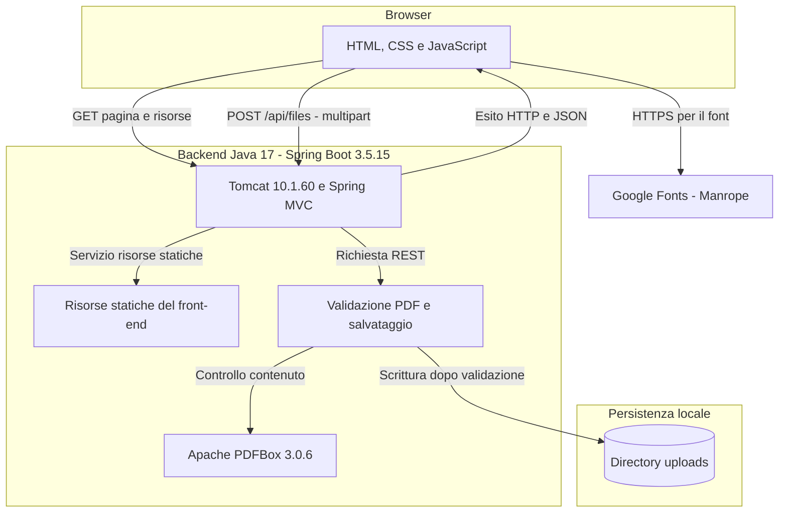
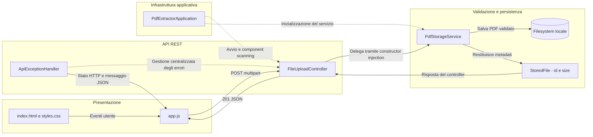

# Architecture Diagram

Documento di architettura di PDF Extractor, aggiornato al 24 settembre 2026 in base al codice e alla configurazione del progetto. L'applicazione consente di selezionare un PDF, validarlo e salvarlo sul filesystem locale del backend; l'estrazione del testo non e' ancora implementata.

## Application Architecture

<!-- mermaid-checked: no \n, no em-dash/en-dash, no {} in labels, subgraphs are id["label"], arrows are -->|"label"|, all subgraphs closed by end, ids unique -->


### Technology Stack Summary

| Livello | Tecnologia | Versione | Scopo |
| --- | --- | --- | --- |
| Front-end | HTML, CSS, JavaScript nativo | HTML5, CSS moderno | Interfaccia responsive e gestione della selezione |
| Comunicazione | Fetch API e FormData | API native del browser | Upload HTTP multipart e lettura del risultato JSON |
| Grafica | Manrope e icona SVG basata su Lucide | Font e asset statico | Tipografia e pulsante di selezione |
| Runtime | Java / OpenLogic OpenJDK | Target Java 17; JDK locale 17.0.9+9 | Esecuzione del backend |
| Framework | Spring Boot | 3.5.15 | Avvio, autoconfigurazione, dependency injection e packaging |
| API | Spring Framework / Spring MVC | 6.2.19 | Controller REST, multipart e gestione degli errori |
| Server HTTP | Apache Tomcat embedded | 10.1.60 | Server incluso nell'applicazione, senza installazione separata |
| PDF | Apache PDFBox | 3.0.6 | Parsing e controlli sul documento |
| JSON | Jackson BOM | 2.21.5 | Gestione delle versioni Jackson e serializzazione JSON |
| Logging | SLF4J con Logback | Logback 1.5.34 | Log applicativi; bridge Log4j2 configurato alla versione 2.25.5 |
| Persistenza | Java NIO e filesystem | API Java 17 | Directory, file temporanei e file PDF finali |
| Build | Apache Maven e Spring Boot Maven Plugin | Maven 3.9; plugin 3.5.15 | Compilazione, test e JAR eseguibile |
| Test backend | Spring Boot Starter Test | 3.5.15 | JUnit Jupiter e strumenti di test Spring |
| Test front-end | JavaScript nel browser | Senza test runner esterno | Verifica dei controlli e degli stati dell'interfaccia |

Le versioni delle librerie sono quelle dichiarate o gestite dalla configurazione Maven. Non sono presenti framework JavaScript, npm o una fase di build dedicata al front-end.

### Data Storage & External Services

La persistenza usa esclusivamente il filesystem del server: non sono presenti database, cache, code o servizi cloud. Il percorso predefinito e' `./uploads`, configurabile tramite `UPLOAD_DIR`. I file non vengono inviati a servizi esterni; Google Fonts viene contattato dal browser soltanto per scaricare il font, con fallback sans-serif in assenza di rete.

### Key Architectural Decisions

- Front-end e backend sono separati a livello di codice e responsabilita', ma distribuiti insieme: Maven copia le risorse web nella directory `static` del backend. Spring Boot serve pagina e API dalla stessa origine; non occorre configurare CORS nell'assetto attuale.
- La validazione nel browser migliora il feedback, ma il backend ripete i controlli e analizza il contenuto prima di salvarlo. Il MIME dichiarato dal client non costituisce una prova della tipologia del file.
- Ogni PDF viene salvato con un nome UUID generato dal server, indipendente dal nome originale, senza sostituzione dei file esistenti.

## Component Relationships

<!-- mermaid-checked: no \n, no em-dash/en-dash, no {} in labels, subgraphs are id["label"], arrows are -->|"label"|, all subgraphs closed by end, ids unique -->


### Component Inventory

| Componente | Livello | Tipo | Responsabilita' |
| --- | --- | --- | --- |
| index.html e styles.css | Front-end | Pagina e foglio di stile | Invito, pulsante centrato, layout responsive e messaggi accessibili |
| app.js | Front-end | Script JavaScript | Controlli preliminari, FormData, chiamata REST e feedback |
| PdfExtractorApplication | Backend | Applicazione Spring Boot | Punto di ingresso del processo Java |
| FileUploadController | API | RestController | Riceve la parte multipart `file` e delega il salvataggio |
| PdfStorageService | Servizi | Service | Controlla nome, dimensione e contenuto; salva il PDF |
| StoredFile | API | Record Java | Trasporta identificativo del file e dimensione in byte |
| ApiExceptionHandler | API | RestControllerAdvice | Traduce le eccezioni gestite in risposte JSON |
| application.properties | Configurazione | Properties Spring | Porta, percorso di upload e limiti multipart |
| dev.cmd | Operativita' | Script Windows | Seleziona JDK e Maven, avvia build, test o server |

## Flusso di Upload

1. L'utente seleziona un file tramite il selettore nativo del browser.
2. Il front-end controlla estensione `.pdf` senza distinzione maiuscole/minuscole, dimensione maggiore di zero e limite di 10 MiB. Un errore impedisce la chiamata REST.
3. Durante la richiesta il pulsante viene disabilitato e mostra lo stato di attesa. Il blocco vale per la pagina corrente, non per tutti i client del server.
4. Il browser invia il documento come `multipart/form-data` al backend.
5. Il servizio verifica nuovamente nome ed estensione; rifiuta nomi contenenti `/`, `\` o caratteri nulli, file vuoti e file oltre il limite.
6. Il servizio legge i byte e richiede l'intestazione `%PDF-`, l'apertura tramite PDFBox, almeno una pagina e assenza di cifratura. I PDF protetti o non leggibili vengono rifiutati.
7. Solo dopo la validazione, crea un file temporaneo nella directory di upload, scrive i byte e lo sposta sul nome finale UUID con estensione `.pdf`. La pulizia del temporaneo viene tentata nel blocco `finally`; lo spostamento non richiede esplicitamente l'opzione di atomicita'.
8. Il backend restituisce `201 Created`. Il front-end mostra il messaggio verde solo dopo una risposta positiva; errori HTTP, di rete o di lettura della risposta producono un messaggio rosso. Il pulsante viene riabilitato.

## Contratto REST

| Proprieta' | Valore |
| --- | --- |
| Metodo e percorso | `POST /api/files` |
| Content-Type richiesta | `multipart/form-data` con boundary generato dal client |
| Parte obbligatoria | `file`, contenente un PDF |
| Content-Type risposta | `application/json` |
| Autenticazione | Non implementata |

Esempio illustrativo di risposta positiva, con dimensione espressa in byte:

```json
{
  "id": "2b0e4d68-7180-4b1a-b167-554ca364dcb2.pdf",
  "size": 24576
}
```

| Stato HTTP | Significato |
| --- | --- |
| 201 | File validato e salvato |
| 400 | File mancante, richiesta multipart non valida, nome non valido, file vuoto o contenuto PDF non accettato |
| 413 | Superamento dei limiti di upload |
| 415 | Content-Type della richiesta non supportato |
| 500 | Errore di I/O durante lettura o salvataggio |

Gli errori gestiti dall'applicazione restituiscono un oggetto come il seguente; errori a livello di rete o rifiuti anticipati del contenitore non garantiscono una risposta JSON:

```json
{
  "message": "Il contenuto non e' un PDF valido, leggibile e non protetto."
}
```

Non sono implementate API per elencare, scaricare o eliminare i file, ne' per estrarne il testo.

## Configurazione e Avvio Locale

| Impostazione | Valore predefinito | Note |
| --- | --- | --- |
| Indirizzo di ascolto | `127.0.0.1` | Accessibile dalla macchina locale |
| Porta | `8080` | Variabile `PORT` oppure secondo argomento dello script |
| Directory PDF | `./uploads` | Variabile `UPLOAD_DIR`; i percorsi relativi dipendono dalla directory di lavoro |
| Dimensione massima file | `10MB` | 10 MiB, ossia 10.485.760 byte; controllata anche nel codice |
| Dimensione massima richiesta | `11MB` | Include overhead multipart |
| Soglia multipart in memoria | `10MB` | Configurazione del contenitore, distinta dal salvataggio finale |
| Dati scartati da Tomcat | `12MB` | Limite `max-swallow-size`, utile per rispondere agli upload rifiutati |

La directory di destinazione viene creata all'inizializzazione del servizio e deve essere scrivibile dall'utente del processo Java. Con lo script di avvio, la directory di lavoro e' la radice del progetto, quindi sul computer attuale il percorso predefinito e':

```text
C:\Users\ESERINI52\GitHub\pdf-extractor\uploads
```

La JDK selezionata dallo script e':

```text
C:\Users\ESERINI52\openlogic-openjdk-17.0.9+9-windows-x64
```

Maven viene cercato nel `PATH` oppure in `%USERPROFILE%\.maven\maven-*`. Dalla radice del repository:

```powershell
.\scripts\dev.cmd run
```

Aprire <http://localhost:8080>. Il backend serve anche il front-end: non aprire direttamente la pagina dal filesystem per l'upload. Per usare un'altra porta, eseguire `.\scripts\dev.cmd run 8081`; per arrestare il processo premere Ctrl+C.

Per impostare una destinazione diversa nella sessione PowerShell corrente:

```powershell
$env:UPLOAD_DIR = 'C:\Dati\pdf-extractor\uploads'
.\scripts\dev.cmd run
```

## Build e Verifica

```powershell
.\scripts\dev.cmd test
.\scripts\dev.cmd package
```

Il packaging produce un JAR eseguibile Spring Boot, comprensivo del front-end e di Tomcat. Non e' necessario installare un server Tomcat esterno.

Nella verifica precedente sono passati 18 test backend: 13 del servizio di salvataggio e 5 dell'API, con JDK OpenLogic 17.0.9 e Tomcat 10.1.60. Questa documentazione non implica una nuova esecuzione dei test. I test del front-end sono disponibili nella pagina dedicata nella cartella `tests`; non sostituiscono la verifica end-to-end del salvataggio reale.

## Limiti e Sicurezza

- La validazione PDF non e' una scansione antivirus, una sanitizzazione dei contenuti o una garanzia che il documento sia innocuo.
- Il codice salva i byte originali; il nome originale non viene mantenuto come metadato persistente. Il record restituito non viene registrato in un database.
- Non sono presenti autenticazione, autorizzazione, TLS applicativo, rate limiting o quote globali sullo spazio disco. L'assetto corrente e' destinato all'uso locale, non all'esposizione pubblica.
- Il limite di 10 MiB riguarda ciascun file, non l'occupazione totale in memoria o su disco. Il servizio legge il documento in memoria e PDFBox puo' richiedere ulteriore memoria; upload simultanei aumentano il consumo.
- Backup, conservazione, pulizia dei file e recupero dei temporanei dopo un arresto forzato non sono automatizzati.
- Le impostazioni multipart possono comportare buffering gestito dal contenitore: la garanzia applicativa e' il salvataggio nella directory finale solo dopo validazione, non l'assenza assoluta di file temporanei durante la ricezione HTTP.
- L'estrazione testuale e l'OCR sono sviluppi futuri, non funzionalita' attuali.

## Riferimenti al Codice

- [backend/pom.xml](../../../../../backend/pom.xml): dipendenze, versioni e inclusione del front-end.
- [src/app.js](../../../../../src/app.js): controlli client e chiamata REST.
- [backend/src/main/java/it/pdfextractor/FileUploadController.java](../../../../../backend/src/main/java/it/pdfextractor/FileUploadController.java): endpoint di upload.
- [backend/src/main/java/it/pdfextractor/PdfStorageService.java](../../../../../backend/src/main/java/it/pdfextractor/PdfStorageService.java): validazione e persistenza.
- [backend/src/main/java/it/pdfextractor/ApiExceptionHandler.java](../../../../../backend/src/main/java/it/pdfextractor/ApiExceptionHandler.java): risposte di errore.
- [backend/src/main/resources/application.properties](../../../../../backend/src/main/resources/application.properties): configurazione runtime.
- [scripts/dev.cmd](../../../../../scripts/dev.cmd): comandi operativi Windows.
